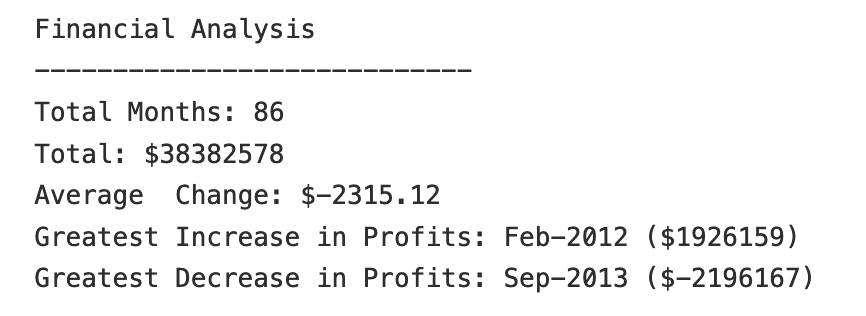
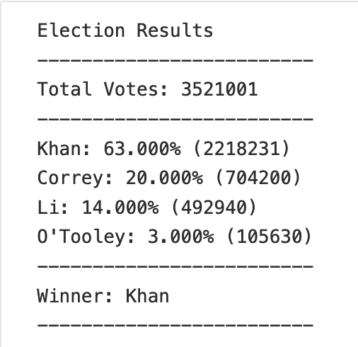

# Python-CSV Data Analysis

Using python scripting to data mine two different CSV datasets and extract the useful data.

## PyBank
Analyze the dataset for a company budget (budget_data.csv) to discover:

  * The total number of months included in the dataset
  * The total net amount of "Profit/Losses" over the entire period
  * The average change in "Profit/Losses" between months over the entire period
  * The greatest increase in profits (date and amount) over the entire period
  * The greatest decrease in losses (date and amount) over the entire period
  
 
  

## Pypoll
Use Python scripting to speed up the counting of the [election_data](PyPoll/Resources/election_data.csv) from a small town by calculating each of the following:

  * The total number of votes cast

  * A complete list of candidates who received votes

  * The percentage of votes each candidate won

  * The total number of votes each candidate won

  * The winner of the election based on popular vote.
  
 

